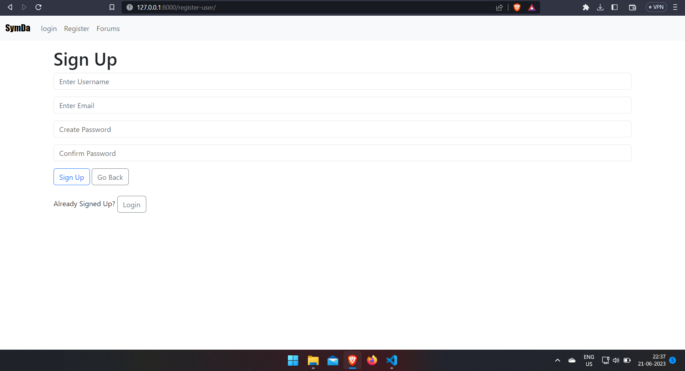
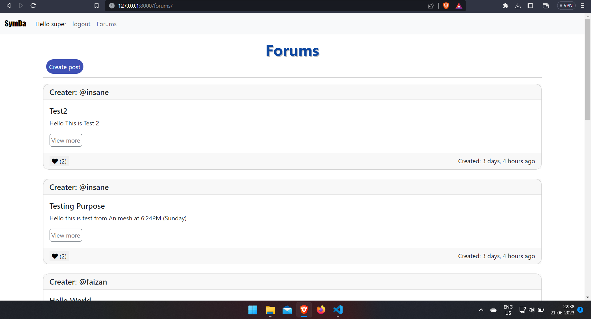
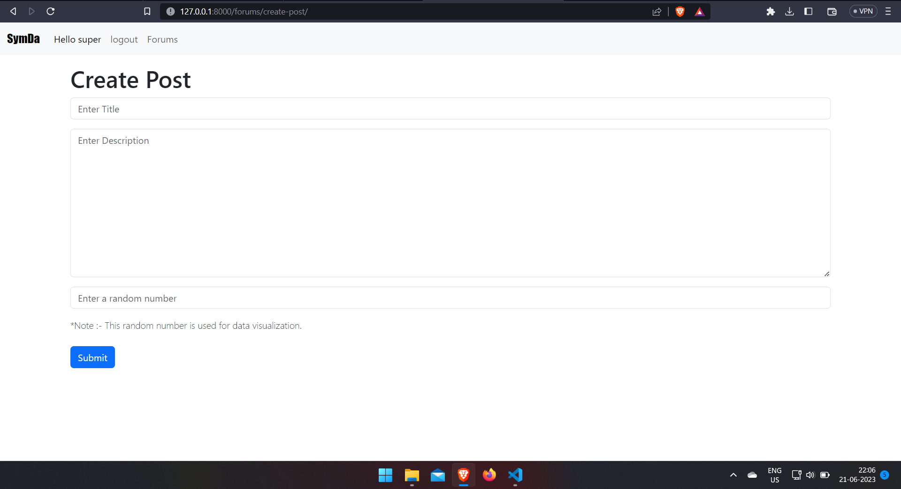
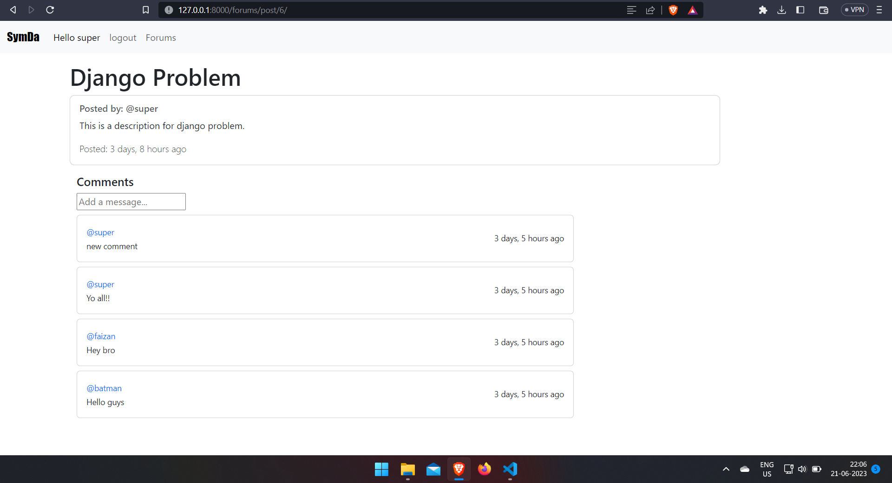

# Post Web

## How to run

*Run all the commands in terminal/shell

**1. Make a virtual environment**
> virtualenv venv

**2. Activate the venv**
> venv\Scripts\activate

**3. Installing the requirements.txt**
> pip install -r requirements.txt

**4. Go to project directory post_web, open settings.py file. At bottom where email configuration is, Replace:**

'os.environ.get('EMAIL_HOST_USER')' with your email

'os.environ.get('EMAIL_HOST_PASS')' with your email password
 
**5. Run project command**
> python manage.py runserver

## Login Page

## Register Page

## Forums Page

## Create Post

## Single Post

