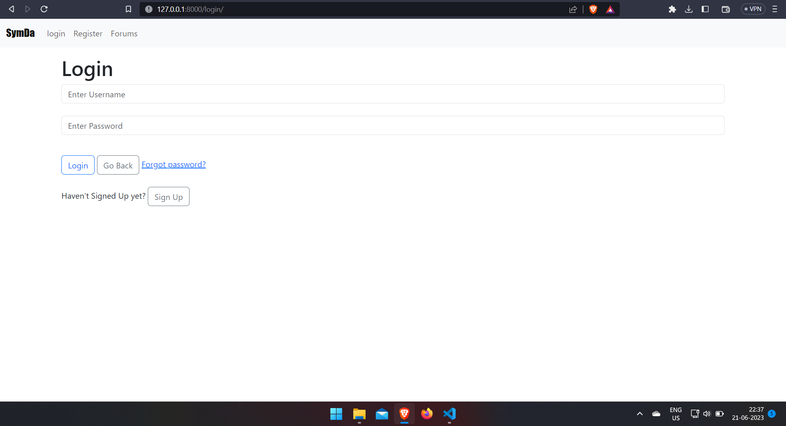

# Post Web

## How to run

*Run all the commands in terminal/shell

**Make a virtual environment**
> virtualenv venv

**Activate the venv**
> venv\Scripts\activate

**Installing the requirements.txt**
> pip install -r requirements.txt
 
**Run project command**
> python manage.py runserver

* A django web app with **CRUD** functionality.

## Login Page

## Register Page

## Forums Page

## Create Post

## Single Post

